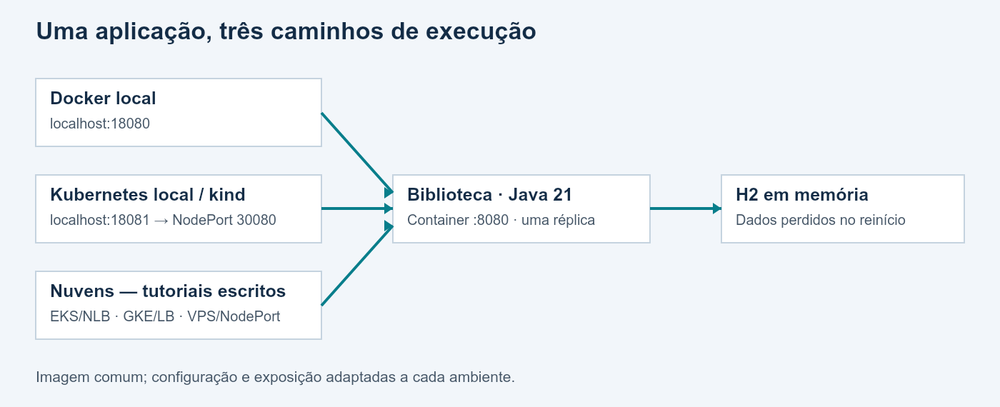
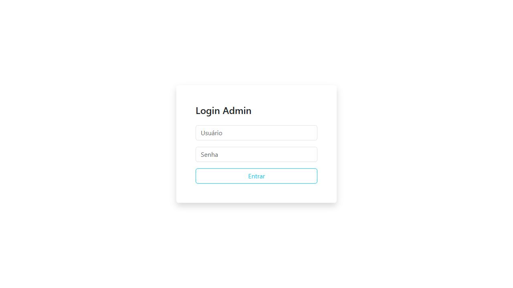
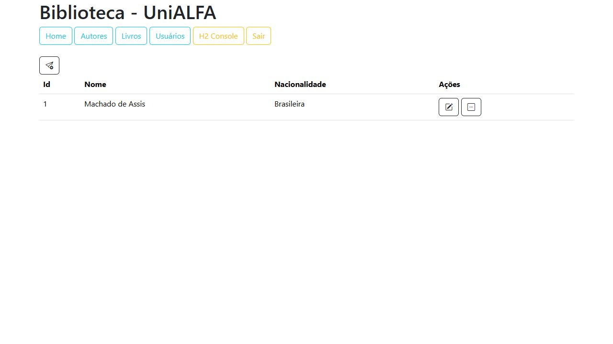
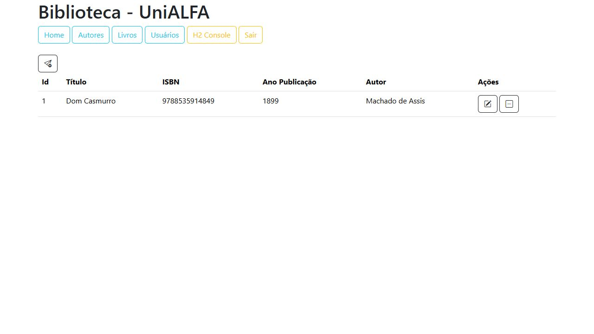
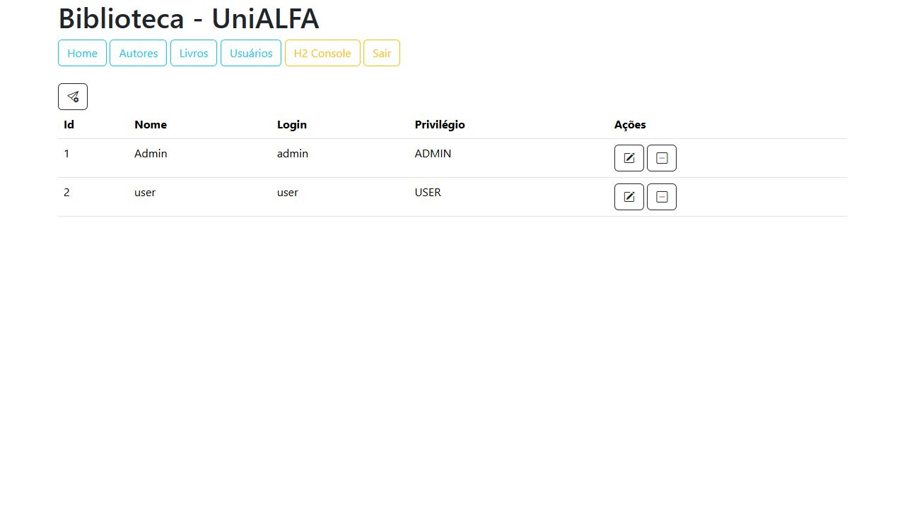
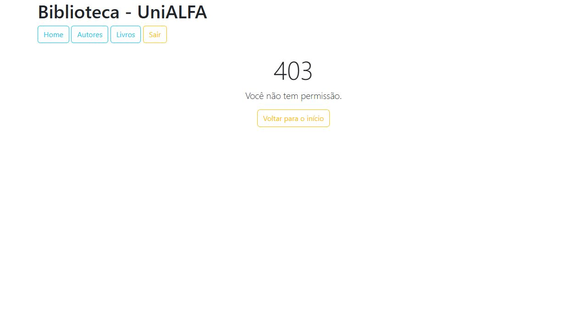
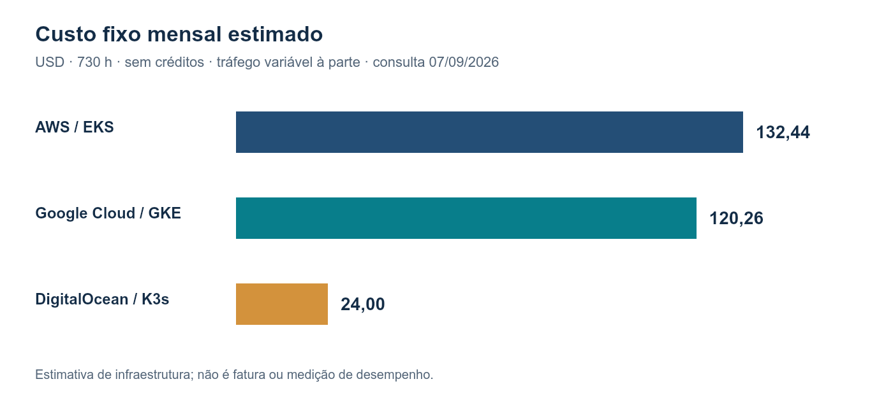

# Biblioteca em Docker e Kubernetes

Trabalho 3 — Cloud Computing e DevOps Avançado

CST em Sistemas para Internet · 6º período

Professor: Diogo P. Ranghetti

Entrega: 10/09/2026

Andre Luiz de Oliveira Zampieri — RA 14623

Gabriel Henrique Friedrichsen — RA 14552

Hendreu Satoshi Zampieri Itami — RA 240061

Demonstração local e tutoriais de AWS, Google Cloud e DigitalOcean.

# Objetivo, escopo e aplicação

Este trabalho apresenta a aplicação Biblioteca em contêiner e organiza três procedimentos de implantação: AWS EKS, Google Cloud GKE e DigitalOcean com K3s. A modalidade adotada pela equipe combina **demonstração local** com **tutoriais escritos para os provedores**. Nenhuma conta de nuvem foi utilizada; resultados esperados nos tutoriais não são apresentados como execução real.

Conforme autorização do professor, confirmada pela equipe, as implantações reais nos provedores foram substituídas pela demonstração local em Docker e Kubernetes e pelos tutoriais escritos de AWS, Google Cloud e DigitalOcean. Esta entrega atende a essa modalidade autorizada. As evidências documentam a execução local; os procedimentos de nuvem são roteiros de implantação e não registros de execução.

## Projeto e versão

- Origem: [dpRanghetti/biblioteca](https://github.com/dpRanghetti/biblioteca).
- Commit de referência: `5a409647ab7277212b7b5ce5237d44ab04323d1d`.
- Spring Boot 4.0.6, Java 21, Maven Wrapper 3.3.4 com distribuição Maven 3.9.15.
- Interface Thymeleaf; API REST com JWT; Spring Data JPA; H2 2.4.240 observado na execução.
- Porta interna: 8080. Banco: `jdbc:h2:mem:banco`.

A alteração de configuração remove o segredo JWT de exemplo das propriedades e exige `API_SECURITY_TOKEN_SECRET` no ambiente. O código de negócio original foi preservado. Os novos arquivos tratam da construção, implantação, testes e documentação. O pacote contém o código necessário e não depende de um repositório da equipe já publicado.

## Arquitetura



Na execução Docker, o navegador acessa `localhost:18080`, mapeado para a porta 8080 do container. No Kubernetes local, `localhost:18081` é encaminhado ao NodePort 30080 do nó kind, ao Service e ao Pod da Biblioteca. Em ambos, o H2 vive dentro do processo Java.

Nos tutoriais de nuvem, o NLB da AWS e o LoadBalancer do GCP expõem porta 80; a VPS usa `IP:30080`. A imagem permanece a mesma. A troca de endereço do registro e do mecanismo de exposição é uma adaptação de infraestrutura, sem outro build da aplicação.

O banco H2 não é compartilhado entre containers ou ambientes. Reiniciar o processo apaga os dados cadastrados; os usuários iniciais são recriados pela aplicação. Por isso o Deployment usa uma réplica e estratégia `Recreate`, evitando duas instâncias com dados divergentes durante atualização. Essa estratégia implica uma interrupção na troca do Pod.

# Construção e execução Docker

## Pré-requisitos locais

Windows com Docker Desktop em modo de containers Linux, virtualização/WSL2 funcionando, PowerShell e kubectl. O iniciador usa kind 0.33.0 para criar um cluster isolado. Recomenda-se reservar memória suficiente para Docker, nó Kubernetes e build Java; a necessidade efetiva depende dos limites configurados no Docker Desktop. Git é necessário para obter o original, mas o código já está incluído neste pacote.

O Java instalado no Windows não participa do build Docker: a imagem de construção fornece Java 21. Na análise inicial havia Java 8 no PATH; usar esse Java para compilar o projeto seria incompatível com o requisito. Uma distribuição Java 21 portátil foi usada na verificação direta complementar, sem substituir o Java do sistema.

## Execução assistida no Windows

1. Extrair **todo o ZIP** para uma pasta; não baixar somente o arquivo `.cmd`.
2. Abrir o Docker Desktop e aguardar o motor estar pronto.
3. Abrir `INICIAR-DEMO.cmd` dentro da pasta extraída.
4. Aguardar build, testes da API, criação do cluster e Deployment disponível.
5. Acessar `http://localhost:18080/login` (Docker) e `http://localhost:18081/login` (Kubernetes).
6. Entrar com `admin/admin` para administração ou `user/user` para testar permissões.
7. Ao terminar a apresentação e as capturas, abrir `ENCERRAR-DEMO.cmd`.

Os logs ficam em `evidencias/`. O arquivo `.runtime/kubeconfig` permite acesso apenas ao cluster local do trabalho e deve permanecer fora da entrega pública. O iniciador não publica imagens nem cria recursos em nuvem. Uma nova execução recria o container Docker do trabalho; para repetir a demonstração completa, encerrar o cluster anterior antes de iniciar.

## Decisões do Dockerfile

O primeiro estágio usa Temurin JDK 21 e o Maven Wrapper do projeto. `clean verify` executa o teste existente e empacota o JAR. O segredo necessário ao teste é gerado temporariamente durante o build; não é um segredo de execução. O estágio final usa Temurin JRE 21, recebe apenas o JAR e roda com usuário numérico não administrador. `MaxRAMPercentage=65.0` limita a fração da memória que o Java pode dedicar ao heap; a memória total também inclui áreas nativas.

As tags das imagens-base acompanham correções do Java 21. Para repetir exatamente um build já realizado, registrar os digests das imagens-base presentes no log; a tag `21-jre` isolada não garante identidade eterna. A imagem final do trabalho é identificada pela tag e pelo digest observado.

`.dockerignore` exclui credenciais, logs, evidências, ferramentas, documentação e artefatos locais do contexto. O Dockerfile está incluído integralmente no apêndice técnico e no pacote.

## Comandos essenciais — PowerShell

Executar na raiz do projeto. O iniciador automatiza estes passos; não executá-los simultaneamente com ele, pois usam o mesmo nome de container.

```powershell
docker version
docker build --platform linux/amd64 --progress plain -t biblioteca:1.0 .
docker image ls biblioteca
docker history biblioteca:1.0
$bytes = New-Object byte[] 32
$rng = [Security.Cryptography.RandomNumberGenerator]::Create()
$rng.GetBytes($bytes)
$rng.Dispose()
$env:API_SECURITY_TOKEN_SECRET = [Convert]::ToBase64String($bytes)
docker run -d --name biblioteca-t3-docker --label trabalho=biblioteca-t3 `
  -p 127.0.0.1:18080:8080 -e API_SECURITY_TOKEN_SECRET biblioteca:1.0
Remove-Item Env:API_SECURITY_TOKEN_SECRET
docker logs biblioteca-t3-docker
powershell -NoProfile -ExecutionPolicy Bypass -File scripts/testar-api.ps1 `
  -BaseUrl http://127.0.0.1:18080 -Destino evidencias/docker-api.json
```

A criação de arquivos de evidência pressupõe a existência da pasta `evidencias`; o iniciador a cria automaticamente. O valor do segredo não deve aparecer no texto dos comandos, em capturas ou em transcrições.

# Kubernetes local

## Recursos e decisões

| Recurso | Função e escolha |
|---|---|
| Namespace biblioteca-t3 | Agrupa somente os recursos do trabalho |
| Secret biblioteca-secret | Recebe o segredo JWT gerado em memória |
| Deployment biblioteca | Uma réplica e atualização Recreate por causa do H2 |
| Recursos do container | Requests 250m CPU/384Mi; limites 1 CPU/768Mi |
| Startup probe | Verifica /login a cada 5 s, até 60 falhas na inicialização |
| Readiness probe | Verifica quando o Pod pode receber tráfego |
| Liveness probe | Detecta ausência de resposta após a inicialização |
| Service NodePort | Encaminha o tráfego local ao container na porta 8080 |
| Contexto isolado | Kubeconfig dentro de .runtime, sem substituir contexto pessoal |

A resposta HTTP da página `/login` é um sinal simples de saúde para o laboratório, não uma avaliação exaustiva de dependências. A startup probe evita que um início lento seja confundido prematuramente com falha do processo.

## Passos equivalentes — PowerShell

Depois do build da imagem e com o executável `tools/kind.exe` disponível:

```powershell
$env:KUBECONFIG = Join-Path (Get-Location) '.runtime/kubeconfig'
$env:KIND_EXPERIMENTAL_PROVIDER = 'docker'
.\tools\kind.exe create cluster --name biblioteca-t3 `
  --config k8s/kind.yaml --kubeconfig $env:KUBECONFIG --wait 300s
.\tools\kind.exe load docker-image biblioteca:1.0 --name biblioteca-t3
kubectl apply -f k8s/namespace.yaml
```

Criar o Secret antes de aplicar o Deployment. O script do pacote o gera e envia pela entrada padrão, evitando gravar seu valor em YAML de entrega. `k8s/secret.example.yaml` é somente um modelo com marcador, não o Secret utilizado.

```powershell
$bytes = New-Object byte[] 32
$rng = [Security.Cryptography.RandomNumberGenerator]::Create()
$rng.GetBytes($bytes)
$rng.Dispose()
$secret = @{
  apiVersion='v1'; kind='Secret'
  metadata=@{name='biblioteca-secret';namespace='biblioteca-t3'}
  type='Opaque'
  stringData=@{'jwt-secret'=[Convert]::ToBase64String($bytes)}
}
$secret | ConvertTo-Json -Depth 6 | kubectl apply -f -
Remove-Variable secret,bytes
kubectl apply -f k8s/deployment.yaml -f k8s/service-local.yaml
kubectl -n biblioteca-t3 rollout status deployment/biblioteca --timeout=300s
kubectl get nodes
kubectl -n biblioteca-t3 get deployment,pods,service -o wide
kubectl -n biblioteca-t3 logs deployment/biblioteca
```

Não aplicar toda a pasta `k8s/` de uma vez: ela contém Services alternativos, configuração kind e um exemplo de Secret. Selecionar os arquivos do ambiente evita sobrescrever o Service ou usar um marcador como segredo.

No local, `kind load docker-image` disponibiliza a imagem sem registro externo. Isso comprova o uso de imagem no cluster local, mas **não equivale a publicar a imagem num registro**. A publicação está documentada nos três roteiros de nuvem.

# Testes e coleta de evidências

## Matriz de aceitação

| Teste | Resultado esperado |
|---|---|
| Build Maven | Finalização com BUILD SUCCESS e teste existente aprovado |
| Build Docker | Imagem biblioteca:1.0 disponível, histórico registrado |
| Login web admin | Acesso à página inicial e aos usuários |
| Autores | Cadastro e consulta com o nome informado |
| Livros | Cadastro e consulta com vínculo ao autor |
| Permissões | user/user recebe 403 ao acessar /usuarios |
| API sem Bearer | HTTP 401 em /api/autores |
| Login API | Token recebido em POST /api/auth/login |
| API autenticada | Cadastro e consulta de autor/livro com token |
| Kubernetes | Deployment disponível, Pod Running e Ready 1/1 |
| Reinício | Dados anteriores deixam de existir; usuários padrão são recriados |
| Limpeza | Container e cluster do laboratório excluídos ao encerrar |

O script `scripts/testar-api.ps1` salva apenas o resultado dos testes, sem o token. A API retorna 404 quando a lista está vazia; depois de cadastrar, retorna 200 com os registros. Esse comportamento do projeto deve ser distinguido de rota inexistente ou falha do cluster.

## Roteiro manual da interface

Entrar como administrador, abrir Autores e cadastrar um autor. Em Livros, cadastrar título, ISBN, ano e selecionar o autor. Consultar as duas listagens. Abrir Usuários e confirmar a administração disponível. Sair, entrar como usuário comum e acessar `/usuarios` diretamente: o resultado esperado é a página 403. Registrar também que os links administrativos não aparecem para esse usuário.

Usar dados fictícios ou públicos de demonstração. A aplicação possui credenciais acadêmicas padrão; não são adequadas a um serviço publicado para uso real. O console H2 deve ser acessado somente com perfil autorizado.

## Diagnóstico

```powershell
kubectl -n biblioteca-t3 get events --sort-by=.metadata.creationTimestamp
kubectl -n biblioteca-t3 describe deployment biblioteca
kubectl -n biblioteca-t3 describe pod NOME_DO_POD
kubectl -n biblioteca-t3 logs deployment/biblioteca
kubectl -n biblioteca-t3 logs deployment/biblioteca --previous
```

`--previous` só produz logs quando existe uma instância anterior do container. Para Secret ausente, conferir nome e chave; para imagem indisponível, conferir tag, carga no kind ou autenticação do registro. Para falta de memória, procurar OOMKilled. Para acesso externo indisponível com Pod saudável, conferir mapeamento, Service, firewall e endereço.

# Organização da entrega e apresentação

O pacote inclui código da Biblioteca, arquivos Docker, manifestos, scripts locais, três tutoriais e comparação. O PDF reúne o material; a versão DOCX e o Markdown permitem edição. As evidências são locais e identificadas pelo ambiente. Contas, tokens, Secret real e kubeconfig não pertencem ao pacote de entrega.

## Divisão para três integrantes

| Integrante | Responsabilidade sugerida |
|---|---|
| Andre Luiz de Oliveira Zampieri | Docker, execução local e explicação do EKS |
| Gabriel Henrique Friedrichsen | Manifestos Kubernetes e explicação do GKE |
| Hendreu Satoshi Zampieri Itami | VPS/K3s e apresentação da comparação |

Todos devem conhecer a imagem utilizada, a limitação do H2, o fluxo de tráfego, os testes e a justificativa da recomendação. A divisão acima é organizacional; não afirma autoria individual de etapas já executadas.

## Apresentação de 8–10 minutos

| Tempo | Conteúdo |
|---|---|
| 0–1 min | Objetivo, escopo local e três tutoriais |
| 1–3 min | Dockerfile, imagem e aplicação em execução |
| 3–5 min | Pod, Service, login e uma operação na Biblioteca |
| 5–7 min | Diferenças entre EKS, GKE e VPS/K3s |
| 7–9 min | Custos, responsabilidade operacional e recomendação |
| 9–10 min | Limitação do H2, evidências e encerramento |

Preparar a execução antes da apresentação, pois downloads e build não cabem no tempo de exposição. Manter as capturas disponíveis caso o ambiente local precise ser reiniciado. Não usar capturas locais como se fossem acesso às nuvens.

## Conferência final para 10/09/2026

A identificação dos três integrantes e RAs está preenchida. O pacote reúne PDF, DOCX, Markdown, código, manifestos, scripts, tutoriais e evidências da execução local validada. A equipe deve revisar o material e ensaiar a apresentação. Os preços têm data de consulta explícita em 07/09/2026; se a entrega ocorrer em 10/09, reconsultar as fontes nessa data. Um integrante deve enviar o PDF e o ZIP para diogo.p.ranghetti@gmail.com, identificando os três integrantes no corpo da mensagem. Nenhum e-mail foi enviado automaticamente.

## Referências gerais

- [Projeto Biblioteca](https://github.com/dpRanghetti/biblioteca)
- [Docker: builds em múltiplos estágios](https://docs.docker.com/build/building/multi-stage/)
- [Docker: boas práticas de build](https://docs.docker.com/build/building/best-practices/)
- [Kubernetes: Deployments](https://kubernetes.io/docs/concepts/workloads/controllers/deployment/)
- [Kubernetes: Services](https://kubernetes.io/docs/concepts/services-networking/service/)
- [Kubernetes: probes](https://kubernetes.io/docs/tasks/configure-pod-container/configure-liveness-readiness-startup-probes/)
- [kind: início rápido](https://kind.sigs.k8s.io/docs/user/quick-start/)
- Ranghetti, Diogo P. Aula 06 — Trabalho Prático: Docker, Kubernetes e Comparação de Provedores. Material fornecido à equipe, 62 slides.

## Versão local validada

A execução final utilizou kind v0.33.0 com Kubernetes v1.35.5. A imagem do nó está fixada por digest em k8s/kind.yaml para reproduzir a versão testada. O cliente kubectl utilizado foi v1.36.1.


# Evidências efetivamente coletadas

As evidências abaixo foram obtidas no computador da equipe. Os três provedores permanecem como roteiros escritos, sem implantação real.

| Parte | Situação |
|---|---|
| Código e build Java | Validado: Maven clean verify, um teste existente aprovado. |
| Imagem Docker | Construída; nome e tamanho registrados no log. |
| API em Docker | Validada pelo script: oito verificações aprovadas. |
| Kubernetes local | Validado: implantação e API registradas. |
| AWS / GCP / VPS | Não executados; tutoriais escritos. |

Imagem observada: `biblioteca:1.0`. O relatório bruto de `docker image ls` está em `evidencias/docker-image.txt`. O tamanho em disco e o tamanho do conteúdo comprimido não são a mesma medida.

## Docker local — localhost:18080

Registro: 2026-09-07T22:27:12.4936571-03:00. URL: http://127.0.0.1:18080.

| Teste | Resultado |
|---|---|
| Pagina de login | Aprovado: HTTP 200 |
| API sem token bloqueada | Aprovado: HTTP 401 |
| Login JWT | Aprovado: Token recebido; valor omitido |
| Cadastrar autor | Aprovado: Autor ID 1 |
| Cadastrar livro | Aprovado: Livro ID 1 |
| Consultar autores | Aprovado: Registro localizado |
| Consultar livros | Aprovado: Registro localizado |
| Login JWT de usuario comum | Aprovado: Token recebido; valor omitido |



## Kubernetes local — localhost:18081

Registro: 2026-09-07T23:06:04.9495224-03:00. URL: http://127.0.0.1:18081.

| Teste | Resultado |
|---|---|
| Pagina de login | Aprovado: HTTP 200 |
| API sem token bloqueada | Aprovado: HTTP 401 |
| Login JWT | Aprovado: Token recebido; valor omitido |
| Cadastrar autor | Aprovado: Autor ID 1 |
| Cadastrar livro | Aprovado: Livro ID 1 |
| Consultar autores | Aprovado: Registro localizado |
| Consultar livros | Aprovado: Registro localizado |
| Login JWT de usuario comum | Aprovado: Token recebido; valor omitido |










## Problemas investigados e situação final

**1. Iniciador separado do restante do projeto.** Ao abrir uma cópia isolada de INICIAR-DEMO.cmd na pasta Downloads, o PowerShell informou que scripts/iniciar-local.ps1 não existia. A causa foi a ausência das subpastas junto ao iniciador. A execução a partir da pasta completa alcançou o build e os testes Docker. Extrair o ZIP inteiro antes de executar.

**2. Falha no armazenamento do Docker durante a criação do Kubernetes.** O build e oito verificações da API Docker passaram. Em seguida, o download da imagem do nó kind falhou com `read-only file system` no arquivo interno `io.containerd.metadata.v1.bolt/meta.db`. A falha impediu criar e validar o cluster; não constitui evidência de erro da aplicação Java.

Foi tentado um reinício autorizado do Docker Desktop e o encerramento do seu ambiente WSL. O Docker registrou erro ao preparar o dispositivo interno `/dev/sdd` e, na tentativa seguinte, erro de acesso ao socket `sailor-ingest.sock`. Naquela tentativa, a recuperação não foi concluída. Posteriormente, o usuário recuperou o Docker e uma nova consulta confirmou o mecanismo respondendo e a Biblioteca em execução. Não foi executado reset, exclusão de volumes ou remoção de distribuições WSL. A causa raiz do problema de armazenamento não foi confirmada.

O computador também apresentava pouco espaço livre no disco C: durante a investigação. Isso é um fator a investigar, não uma causa comprovada. Foram removidos somente downloads e ferramentas temporárias criados para este trabalho.

**3. Imagem do nó não executável após a recuperação.** Na nova tentativa, o nó kind falhou com `exec /usr/local/bin/entrypoint: exec format error`. A imagem informa Linux/amd64, compatível com o host x86_64, mas executar /bin/sh nela também falhou. Recarregar a mesma imagem não resolveu. A causa raiz não está confirmada. O nó temporário malsucedido foi removido; os volumes dos demais projetos foram preservados.

**Resolução e validação final:** após liberar espaço, o disco C: apresentou 8.888.406.016 bytes livres. Foi baixada uma nova imagem oficial Linux/amd64, kindest/node v1.35.5, fixada por digest em k8s/kind.yaml. Com essa imagem, o cluster foi criado, o nó ficou Ready, o Deployment atingiu 1/1 disponível e os oito testes da API passaram em http://127.0.0.1:18081. As capturas registram login, autores, livros, administração e bloqueio 403 para usuário comum. A troca da imagem resolveu a falha de execução observada; não prova a causa raiz da imagem anterior. As nuvens continuam como tutoriais não executados.

Os logs kind-create.txt, k8s-rollout.txt, k8s-nodes.txt, k8s-recursos.txt e kubernetes-api.json registram a execução final. O arquivo erro-inicializacao.txt é histórico da tentativa anterior, não o estado atual. O estado final consta em status-local.json.


## Verificação complementar em Java

Antes da execução em containers, o mesmo projeto foi compilado com Java 21 e validado diretamente na porta 8082. Os logs `java-maven-verify.txt`, `java-api.json` e capturas prefixadas com `java-` registram essa etapa. Essas imagens não são evidências de Docker ou Kubernetes.


# Tutorial 1 — AWS: EKS, ECR e Network Load Balancer

**Status: roteiro documentado, não executado em conta AWS.** Os resultados descritos são critérios de validação esperados. Não existem IPs, capturas ou tempos de implantação medidos na AWS neste trabalho.

## 1. Ambiente e pré-requisitos

Região: `us-east-1` (Norte da Virgínia). EKS convencional, versão 1.35 em suporte padrão; um nó gerenciado `t3.medium` (2 vCPUs, 4 GiB), Amazon Linux 2023, x86-64 e disco gp3 de 20 GiB. A VPC ocupa duas zonas; existe apenas um nó de aplicação. Não há alta disponibilidade da aplicação.

Em uma execução futura, usar uma conta com faturamento e permissões para EKS, EC2/VPC, CloudFormation, IAM, ECR e ELB. Instalar AWS CLI v2, eksctl, kubectl, Helm, Docker, curl e OpenSSL. Os blocos deste tutorial usam **Bash** (Linux/WSL), não PowerShell. Executar a partir da raiz do pacote. Consultar as versões compatíveis na documentação oficial e registrar `aws --version`, `eksctl version`, `kubectl version --client`, `helm version` e `docker version`.

Autenticar pelo método institucional/SSO da conta. Não colocar chaves nos arquivos entregues. Exemplo de configuração por SSO:

```bash
aws configure sso
aws sso login --profile SEU_PERFIL
export AWS_PROFILE=SEU_PERFIL
export AWS_REGION=us-east-1
export CLUSTER=biblioteca-t3
aws sts get-caller-identity
export ACCOUNT_ID=$(aws sts get-caller-identity --query Account --output text)
export ECR="$ACCOUNT_ID.dkr.ecr.$AWS_REGION.amazonaws.com"
export IMAGE="$ECR/biblioteca:1.0"
```

Substituir `SEU_PERFIL` pelo perfil configurado. A identidade exibida deve pertencer à conta de laboratório pretendida.

## 2. Publicar a imagem já construída

Usar a imagem `biblioteca:1.0` validada localmente; não realizar outro build. Se este terminal usa outro motor Docker, transferir a imagem com `docker save` e `docker load` antes desta etapa.

```bash
aws ecr create-repository --repository-name biblioteca --region "$AWS_REGION"
aws ecr get-login-password --region "$AWS_REGION" |
  docker login --username AWS --password-stdin "$ECR"
docker tag biblioteca:1.0 "$IMAGE"
docker push "$IMAGE"
aws ecr describe-images --repository-name biblioteca \
  --image-ids imageTag=1.0 --region "$AWS_REGION"
```

Registrar o digest da imagem. O repositório ECR é privado. O grupo de nós criado pelo eksctl deve possuir permissão de pull do ECR; confirmar as políticas do papel IAM do nó em caso de `ImagePullBackOff`.

## 3. Criar o cluster

O arquivo `cloud/eks-cluster.yaml` define um nó e desabilita o NAT Gateway. Os nós ficam em sub-redes públicas para o laboratório, com SSH desabilitado. A API e os grupos de segurança devem ser revistos antes de qualquer uso de produção. A escolha reduz componentes cobrados e precisa constar da comparação.

```bash
aws eks describe-cluster-versions --region "$AWS_REGION"
eksctl create cluster -f cloud/eks-cluster.yaml
aws eks update-kubeconfig --name "$CLUSTER" --region "$AWS_REGION"
kubectl config current-context
kubectl get nodes -o wide
```

Antes de criar, confirmar que a versão 1.35 aparece como disponível e em suporte padrão. Se indisponível, escolher uma versão suportada, atualizar o YAML e registrar a alteração. Não deixar a versão entrar em suporte estendido na projeção de preços.

## 4. Instalar o controlador de balanceamento

O Service deste pacote exige o **AWS Load Balancer Controller**. Um Service isolado não instala o controlador. A receita abaixo fixa o chart 1.14.0 e a política da versão 2.14.1, conforme a referência consultada. Confirmar compatibilidade se a versão do cluster for alterada.

```bash
curl -fsSLo /tmp/biblioteca-lbc-policy.json \
  https://raw.githubusercontent.com/kubernetes-sigs/aws-load-balancer-controller/v2.14.1/docs/install/iam_policy.json
aws iam create-policy --policy-name BibliotecaT3LoadBalancerPolicy \
  --policy-document file:///tmp/biblioteca-lbc-policy.json
eksctl create iamserviceaccount --cluster "$CLUSTER" \
  --region "$AWS_REGION" --namespace kube-system \
  --name aws-load-balancer-controller \
  --attach-policy-arn "arn:aws:iam::$ACCOUNT_ID:policy/BibliotecaT3LoadBalancerPolicy" \
  --approve
export VPC_ID=$(aws eks describe-cluster --name "$CLUSTER" \
  --region "$AWS_REGION" --query cluster.resourcesVpcConfig.vpcId --output text)
helm repo add eks https://aws.github.io/eks-charts
helm repo update eks
helm upgrade --install aws-load-balancer-controller \
  eks/aws-load-balancer-controller --version 1.14.0 \
  --namespace kube-system \
  --set clusterName="$CLUSTER" \
  --set region="$AWS_REGION" --set vpcId="$VPC_ID" \
  --set serviceAccount.create=false \
  --set serviceAccount.name=aws-load-balancer-controller \
  --set replicaCount=1 \
  --set controllerConfig.featureGates.ALBGatewayAPI=false \
  --set controllerConfig.featureGates.NLBGatewayAPI=false
kubectl -n kube-system rollout status deployment/aws-load-balancer-controller \
  --timeout=300s
```

O Gateway API fica desabilitado porque este laboratório usa Service de camada 4. A opção evita introduzir CRDs de Gateway que não fazem parte da arquitetura. A réplica única do controlador é uma escolha de laboratório; não representa uma configuração resiliente.

## 5. Implantar e acessar

```bash
bash scripts/aplicar-nuvem.sh aws "$IMAGE"
kubectl -n biblioteca-t3 get service biblioteca -w
```

Interromper a observação com Ctrl+C quando surgir o hostname externo. Abrir `http://HOSTNAME_DO_NLB/login`. O Service usa porta pública 80, destino 8080 e NLB voltado à internet; o balanceamento entre zonas está habilitado para atender à arquitetura com apenas um nó. O valor do Secret é gerado em memória pelo script.

## 6. Validar e registrar

```bash
kubectl -n biblioteca-t3 get deployment,pods,service -o wide
kubectl -n biblioteca-t3 describe deployment biblioteca
kubectl -n biblioteca-t3 logs deployment/biblioteca
kubectl -n biblioteca-t3 get events --sort-by=.metadata.creationTimestamp
```

Resultados esperados: Deployment disponível 1/1, Pod Running e Ready 1/1, hostname externo, login `admin/admin`, cadastro e consulta de um autor e livro. Validar também a API e o bloqueio de `/usuarios` para `user/user`, conforme a matriz de testes do documento. Registrar região, imagem, nó, telas e logs sem segredos. Medir o tempo real somente se o roteiro for executado.

## 7. Limpeza

Excluir primeiro o Service enquanto o controlador ainda está funcionando e aguardar a remoção do NLB no painel EC2/Load Balancers. Isso permite que o controlador libere balanceador, interfaces e endereços associados.

```bash
kubectl -n biblioteca-t3 delete service biblioteca --wait=true
kubectl delete namespace biblioteca-t3
helm uninstall aws-load-balancer-controller -n kube-system
eksctl delete iamserviceaccount --cluster "$CLUSTER" --region "$AWS_REGION" \
  --namespace kube-system --name aws-load-balancer-controller
eksctl delete cluster --name "$CLUSTER" --region "$AWS_REGION" --wait
aws ecr delete-repository --repository-name biblioteca \
  --region "$AWS_REGION" --force
aws iam delete-policy \
  --policy-arn "arn:aws:iam::$ACCOUNT_ID:policy/BibliotecaT3LoadBalancerPolicy"
```

Esses comandos destinam-se exclusivamente aos recursos criados para este roteiro. Conferir CloudFormation, EKS, instâncias, volumes EBS, NLBs, interfaces de rede, endereços públicos e ECR. Apagar também um eventual provedor OIDC órfão somente depois de confirmar que pertence a este cluster e não é utilizado por outro recurso. Não usar remoções abrangentes de recursos da conta.

## Referências

- [EKS: nós gerenciados](https://docs.aws.amazon.com/eks/latest/eksctl/nodegroup-managed.html)
- [eksctl: VPC e NAT Gateway](https://docs.aws.amazon.com/eks/latest/eksctl/vpc-configuration.html)
- [AWS Load Balancer Controller com Helm](https://docs.aws.amazon.com/eks/latest/userguide/lbc-helm.html)
- [Network Load Balancers no EKS](https://docs.aws.amazon.com/eks/latest/userguide/network-load-balancing.html)
- [Preços do EKS](https://aws.amazon.com/eks/pricing/)


# Tutorial 2 — Google Cloud: GKE Standard e Artifact Registry

**Status: roteiro documentado, não executado em conta Google Cloud.** Resultados e endereços indicados são critérios esperados, não evidências coletadas.

## 1. Ambiente e ferramentas

GKE Standard **zonal**, região `us-central1` (Iowa), zona `us-central1-a`, um nó `e2-medium` (2 vCPUs compartilhadas, 4 GiB), Linux Container-Optimized OS com containerd, x86-64 e disco `pd-standard` de 20 GiB. A escolha Standard permite explicitar o nó para a comparação com EKS e VPS; o Autopilot tem modelo de recursos e cobrança diferente.

Uma execução futura exige projeto com faturamento, permissões para habilitar APIs, criar cluster, gerenciar contas de serviço/IAM e escrever no Artifact Registry. Usar Bash, Google Cloud CLI, `gke-gcloud-auth-plugin`, kubectl, Docker e OpenSSL. Registrar suas versões. No Cloud Shell, enviar o pacote e a imagem previamente criada; não presumir que a imagem do computador exista no Docker do Cloud Shell.

## 2. Definir projeto, APIs e registro

```bash
gcloud auth login
export PROJECT_ID=SUBSTITUIR_PELO_ID_DO_PROJETO
export REGION=us-central1
export ZONE=us-central1-a
export CLUSTER=biblioteca-t3
gcloud config set project "$PROJECT_ID"
gcloud services enable container.googleapis.com \
  artifactregistry.googleapis.com compute.googleapis.com iam.googleapis.com
gcloud artifacts repositories create biblioteca --repository-format=docker \
  --location "$REGION" --description 'Laboratorio Biblioteca T3'
gcloud auth configure-docker "$REGION-docker.pkg.dev"
export IMAGE="$REGION-docker.pkg.dev/$PROJECT_ID/biblioteca/biblioteca:1.0"
docker tag biblioteca:1.0 "$IMAGE"
docker push "$IMAGE"
gcloud artifacts docker images list \
  "$REGION-docker.pkg.dev/$PROJECT_ID/biblioteca" --include-tags
```

Substituir apenas o ID do projeto; os demais nomes são os recursos dedicados do laboratório. A imagem é a mesma construída localmente. Registrar digest e tamanho publicado.

## 3. Autorizar os nós a ler o registro

Uma conta de serviço específica torna explícita a permissão de pull e evita depender de permissões automáticas da conta padrão.

```bash
gcloud iam service-accounts create biblioteca-gke \
  --display-name 'Nos do laboratorio Biblioteca'
export NODE_SA="biblioteca-gke@$PROJECT_ID.iam.gserviceaccount.com"
gcloud projects add-iam-policy-binding "$PROJECT_ID" \
  --member "serviceAccount:$NODE_SA" \
  --role roles/container.defaultNodeServiceAccount
gcloud artifacts repositories add-iam-policy-binding biblioteca \
  --location "$REGION" --member "serviceAccount:$NODE_SA" \
  --role roles/artifactregistry.reader
```

## 4. Criar o cluster

```bash
gcloud compute networks create biblioteca-t3-net --subnet-mode=custom
gcloud compute networks subnets create biblioteca-t3-subnet \
  --network biblioteca-t3-net --region "$REGION" --range 10.20.0.0/24 \
  --secondary-range pods=10.21.0.0/16,services=10.22.0.0/20
gcloud container clusters create "$CLUSTER" --zone "$ZONE" \
  --release-channel regular --num-nodes 1 --machine-type e2-medium \
  --image-type COS_CONTAINERD --disk-type pd-standard --disk-size 20 \
  --service-account "$NODE_SA" --scopes cloud-platform \
  --network biblioteca-t3-net --subnetwork biblioteca-t3-subnet \
  --enable-ip-alias --cluster-secondary-range-name pods \
  --services-secondary-range-name services \
  --logging=NONE --monitoring=NONE
gcloud container clusters get-credentials "$CLUSTER" --zone "$ZONE"
kubectl config current-context
kubectl get nodes -o wide
```

O canal regular seleciona uma versão disponibilizada pelo GKE; registrar a versão efetivamente criada com `gcloud container clusters describe`. Um cluster regional poderia criar nós em várias zonas, alterando substancialmente o custo. O roteiro é zonal, com um nó, sem autoscaling e sem exportação de logs/métricas para serviços pagos. `kubectl logs` continua disponível. A rede dedicada facilita a remoção posterior. O nó usa IP externo; não há Cloud NAT neste cenário.

## 5. Implantar e validar

```bash
bash scripts/aplicar-nuvem.sh gcp "$IMAGE"
kubectl -n biblioteca-t3 get service biblioteca -w
```

Aguardar um IP no campo `EXTERNAL-IP` e interromper com Ctrl+C. Abrir `http://IP_EXTERNO/login`. O LoadBalancer encaminha a porta 80 para 8080. Executar a matriz de testes, salvar a listagem de nós, Deployment/Pod/Service, login, operação na Biblioteca e logs. O IP e os tempos só devem ser registrados como reais após execução.

```bash
kubectl -n biblioteca-t3 get deployment,pods,service -o wide
kubectl -n biblioteca-t3 logs deployment/biblioteca
kubectl -n biblioteca-t3 get events --sort-by=.metadata.creationTimestamp
gcloud container clusters describe "$CLUSTER" --zone "$ZONE" \
  --format='yaml(currentMasterVersion,nodePools)'
```

## 6. Limpeza

```bash
kubectl -n biblioteca-t3 delete service biblioteca --wait=true
kubectl delete namespace biblioteca-t3
gcloud container clusters delete "$CLUSTER" --zone "$ZONE"
gcloud artifacts repositories delete biblioteca --location "$REGION"
gcloud projects remove-iam-policy-binding "$PROJECT_ID" \
  --member "serviceAccount:$NODE_SA" \
  --role roles/container.defaultNodeServiceAccount
gcloud iam service-accounts delete "$NODE_SA"
gcloud compute networks subnets delete biblioteca-t3-subnet --region "$REGION"
gcloud compute networks delete biblioteca-t3-net
```

Conferir que a exclusão do Service removeu encaminhamento e balanceador antes de excluir o cluster. No console, verificar instâncias, discos, endereços reservados, regras de encaminhamento, imagens e redes. Se uma dependência impedir apagar a rede, identificar o recurso remanescente e confirmar que pertence ao laboratório. Não apagar recursos de outro projeto/trabalho.

## Referências

- [Implantação de aplicação no GKE](https://cloud.google.com/kubernetes-engine/docs/deploy-app-cluster)
- [Criação de cluster Standard](https://cloud.google.com/kubernetes-engine/docs/how-to/creating-a-zonal-cluster)
- [Acesso ao Artifact Registry pelo GKE](https://cloud.google.com/artifact-registry/docs/integrate-gke)
- [Conta de serviço dos nós](https://cloud.google.com/kubernetes-engine/docs/how-to/service-accounts)
- [Preços do GKE](https://cloud.google.com/kubernetes-engine/pricing)


# Tutorial 3 — DigitalOcean Droplet com K3s

**Status: roteiro documentado, não executado em VPS.** As verificações abaixo descrevem resultados esperados.

## 1. Configuração proposta

DigitalOcean, região `nyc3` (Nova York), Droplet Basic Regular de 2 vCPUs, 4 GiB de RAM, SSD de 80 GiB e franquia de transferência de 4.000 GiB. Sistema Ubuntu 24.04 LTS x86-64. Um único servidor executa o controle do Kubernetes e a aplicação. Não é o produto DOKS gerenciado.

Em uma execução futura, criar o Droplet pelo painel: Create → Droplets → Ubuntu 24.04 LTS → Basic/Regular → plano 2 vCPUs/4 GiB → NYC3 → autenticação por chave SSH → nome `biblioteca-t3`. Não habilitar backups pagos no cenário base. Registrar o preço mostrado antes da criação e conferir a disponibilidade do plano na região.

Criar um Cloud Firewall e associá-lo ao Droplet. Entrada: TCP 22 somente do IP administrativo e TCP 30080 somente dos IPs usados para a demonstração. Saída: permitir o tráfego necessário para DNS, atualizações e pull das imagens. Não abrir a API Kubernetes 6443 nem as portas internas do K3s para a internet; usar `kubectl` via SSH. Para uma demonstração pública sem restrição de origem, a exposição e os riscos das credenciais acadêmicas precisariam ser revistos.

## 2. Publicar a imagem e transferir arquivos

Usar Bash em Linux/WSL. Criar no Docker Hub um repositório público `biblioteca` dentro do usuário da equipe. A publicação futura pressupõe permissão para distribuir o código fornecido pelo professor; para repositório privado, configurar pull autenticado. Não publicar chaves ou o Secret.

```bash
export DOCKERHUB_USER=SUBSTITUIR_PELO_USUARIO
export VPS_IP=SUBSTITUIR_PELO_IPV4
export IMAGE="docker.io/$DOCKERHUB_USER/biblioteca:1.0"
docker login
docker tag biblioteca:1.0 "$IMAGE"
docker push "$IMAGE"
ssh root@"$VPS_IP" 'mkdir -p /opt/biblioteca-t3'
scp -r k8s scripts root@"$VPS_IP":/opt/biblioteca-t3/
ssh root@"$VPS_IP"
```

O build não é repetido na VPS. `scp` copia somente os manifestos e scripts, sem credenciais locais. Se usar Windows sem WSL, executar `ssh`/`scp` no PowerShell adaptando as variáveis.

## 3. Instalar o K3s

Os próximos comandos são executados **dentro da VPS**, como administrador:

```bash
apt-get update
apt-get install -y curl ca-certificates openssl
curl -fsSL https://get.k3s.io -o /tmp/install-k3s.sh
less /tmp/install-k3s.sh
INSTALL_K3S_CHANNEL=stable sh /tmp/install-k3s.sh \
  --disable traefik --disable servicelb
kubectl get nodes -o wide
k3s --version
cd /opt/biblioteca-t3
export KUBECONFIG=/etc/rancher/k3s/k3s.yaml
export IMAGE=docker.io/SUBSTITUIR_PELO_USUARIO/biblioteca:1.0
bash scripts/aplicar-nuvem.sh vps "$IMAGE"
```

O canal stable resolve uma versão na data de execução; registrar `k3s --version` e, para repetição exata, substituir por `INSTALL_K3S_VERSION` com a versão registrada. Traefik e ServiceLB ficam desabilitados porque a exposição escolhida é NodePort. O K3s já inclui containerd e kubectl; não é necessário instalar Docker no servidor.

## 4. Acesso e evidências

Abrir `http://IP_DA_VPS:30080/login` a partir de um IP autorizado no firewall. O mesmo manifesto NodePort usado no cluster local encaminha 30080 → Service 80 → container 8080.

```bash
kubectl -n biblioteca-t3 get deployment,pods,service -o wide
kubectl -n biblioteca-t3 logs deployment/biblioteca
kubectl -n biblioteca-t3 get events --sort-by=.metadata.creationTimestamp
```

Verificar Pod Ready 1/1, login, cadastros e API. Um endereço inacessível com Pod saudável costuma exigir conferir firewall, IP, NodePort e regras de rede. Não reiniciar ou reinstalar o cluster sem investigar.

**HTTPS:** esta demonstração usa HTTP. Para publicação continuada, apontar um domínio ao servidor, usar Ingress ou proxy reverso com certificado de uma autoridade reconhecida, configurar renovação e expor 80/443. Esse acréscimo não foi implantado nem incluído no cenário financeiro. O H2 em memória e as credenciais iniciais também precisariam ser substituídos para uso real.

## 5. Limpeza

Dentro da VPS:

```bash
kubectl delete namespace biblioteca-t3
/usr/local/bin/k3s-uninstall.sh
exit
```

No painel DigitalOcean, abrir o Droplet `biblioteca-t3` → Destroy e excluir o servidor. Conferir separadamente volumes, snapshots, backups, IPs reservados e firewall criados para a atividade. Desligar o Droplet não equivale a excluí-lo para fins de cobrança. No Docker Hub, remover a tag/repositório do laboratório se não for mais necessário. Registrar a ausência de recursos ativos no painel, sem dados pessoais de faturamento.

## Referências

- [Criação de Droplets](https://docs.digitalocean.com/products/droplets/how-to/create/)
- [Preços oficiais dos Droplets](https://www.digitalocean.com/pricing/droplets)
- [Cloud Firewalls](https://docs.digitalocean.com/products/networking/firewalls/how-to/configure-rules/)
- [K3s: início rápido](https://docs.k3s.io/quick-start)
- [Requisitos do K3s](https://docs.k3s.io/installation/requirements)
- [Desinstalação do K3s](https://docs.k3s.io/installation/uninstall)


# Comparação de custos e operação

## Premissas e limites

Consulta: **07/09/2026**, horário de Brasília. Entrega prevista: **10/09/2026**. Reconsultar as fontes no dia da entrega, conforme o enunciado; não alterar a data de consulta sem conferir os preços novamente. Moeda: USD. Não houve contratação nem faturamento real nas nuvens.

O cenário financeiro é uma estimativa do **custo fixo para manter a infraestrutura disponível**, por 730 horas mensais. Inclui um nó de aproximadamente 2 vCPUs/4 GiB, uma réplica da Biblioteca e 1 GiB de imagem armazenada no registro pago. Esse 1 GiB é uma premissa de orçamento, não o tamanho medido da imagem. Não inclui descontos por compromisso, Spot, créditos de inscrição ou franquias promocionais.

A comparação aproxima memória e vCPUs anunciadas, mas não iguala desempenho ou disponibilidade: T3 usa créditos de CPU, E2-medium usa CPU compartilhada e Droplet Basic também compartilha CPU. Na VPS o control plane ocupa a mesma máquina da aplicação; EKS e GKE o executam separadamente. Os discos diferem em capacidade e tecnologia. Nenhuma conclusão de desempenho foi medida nas nuvens.

## Configurações comparadas

| Critério | AWS | Google Cloud | DigitalOcean |
|---|---|---|---|
| Produto | EKS convencional | GKE Standard zonal | Droplet Basic Regular + K3s |
| Região | us-east-1 | us-central1-a | nyc3 |
| Nó | 1 × t3.medium | 1 × e2-medium | 1 × 2 vCPUs / 4 GiB |
| Sistema | Amazon Linux 2023 | COS_CONTAINERD | Ubuntu 24.04 LTS |
| Arquitetura | x86-64 | x86-64 | x86-64 |
| Disco | gp3, 20 GiB | pd-standard, 20 GiB | SSD, 80 GiB incluídos |
| Exposição | NLB em 2 zonas | LoadBalancer regional | NodePort 30080 |
| Registro | ECR privado, 1 GiB | Artifact Registry, 1 GiB | Docker Hub público |

## Estimativa mensal — USD

| Componente | AWS | Google Cloud | DigitalOcean |
|---|---:|---:|---:|
| Gerenciamento do cluster | 73,00 | 73,00 | 0,00 — administrado pela equipe |
| Computação | 30,37 | 24,46 | 24,00 — pacote mensal |
| Disco do nó | 1,60 | 0,80 | Incluído |
| Registro da imagem | 0,10 | 0,10 | 0,00 — plano público |
| Balanceador: parcela fixa | 16,43 | 18,25 | 0,00 — NodePort |
| IPv4 público | 10,95 | 3,65 | Incluído no pacote |
| **Total fixo mensal estimado** | **132,44** | **120,26** | **24,00** |
| **Projeção fixa de laboratório por 3 h** | **0,54** | **0,49** | **0,11** |
| Tempo de implantação | Não medido | Não medido | Não medido |

Os totais usam os valores sem arredondamento intermediário. A projeção de 3 horas rateia disco/registro sobre 730 horas e supõe remoção imediata de todos os recursos ao terminar. É uma aproximação de orçamento, não uma promessa de fatura. Tempo de provisionamento, armazenamento mantido, arredondamentos, tráfego e serviços opcionais podem acrescentar valores.

O Droplet selecionado é um **plano empacotado**, limitado a US$ 24/mês, e não o produto v5 por recurso. Para 3 horas usa-se US$ 0,03571/h. A documentação informa teto de 672 horas mensais para esses planos e cobrança mínima de 60 segundos ou US$ 0,01. Portanto, não se deve multiplicar a tarifa horária por 730 e ignorar o teto mensal.



## Memória de cálculo e fontes

| Item | Tarifa usada | Cálculo mensal | Fonte |
|---|---|---|---|
| EKS suporte padrão | 0,10 / cluster-h | 0,10 × 730 = 73,00 | [EKS](https://aws.amazon.com/eks/pricing/) |
| EC2 t3.medium | 0,0416 / h | 0,0416 × 730 = 30,368 | [AWS: tabela us-east-1](https://docs.aws.amazon.com/prescriptive-guidance/latest/optimize-costs-microsoft-workloads/right-size-selection.html) |
| EBS gp3 | 0,08 / GiB-mês | 20 × 0,08 = 1,60 | [EBS](https://aws.amazon.com/ebs/pricing/) |
| ECR | 0,10 / GiB-mês | 1 × 0,10 = 0,10 | [ECR](https://aws.amazon.com/ecr/pricing/) |
| NLB | 0,0225 / h | 0,0225 × 730 = 16,425 | [ELB](https://aws.amazon.com/elasticloadbalancing/pricing/) |
| IPv4 AWS | 0,005 / IP-h | 3 × 0,005 × 730 = 10,95 | [VPC AWS](https://aws.amazon.com/vpc/pricing/) |
| GKE suporte padrão | 0,10 / cluster-h | 0,10 × 730 = 73,00 | [GKE](https://cloud.google.com/kubernetes-engine/pricing) |
| E2-medium | 0,03350571 / h | 0,03350571 × 730 = 24,4591683 | [Compute Engine, general purpose](https://cloud.google.com/products/compute/pricing/general-purpose) |
| Persistent Disk Standard | 0,04 / GiB-mês | 20 × 0,04 = 0,80 | [Discos GCP](https://cloud.google.com/products/block-storage) |
| Artifact Registry | 0,10 / GiB-mês | 1 × 0,10 = 0,10 | [Artifact Registry](https://cloud.google.com/artifact-registry/pricing) |
| Encaminhamento GCP | 0,025 / h | 0,025 × 730 = 18,25 | [Load Balancing](https://cloud.google.com/load-balancing/pricing) |
| IPv4 do nó GCP | 0,005 / IP-h | 1 × 0,005 × 730 = 3,65 | [VPC GCP](https://cloud.google.com/vpc/network-pricing) |
| Droplet Basic Regular | 24,00 / mês | Pacote com teto mensal | [Droplets](https://www.digitalocean.com/pricing/droplets) |

Na AWS contam-se um IPv4 do nó e dois IPv4 do NLB em duas zonas. No GCP conta-se um IPv4 do nó; o endereço associado à regra de encaminhamento não recebe cobrança adicional de IPv4 nessa categoria. Confirmar a quantidade realmente alocada se o roteiro for executado.

## Custos variáveis e itens fora do cenário

O total fixo considera **zero tráfego de aplicação para fins de cálculo**, para tornar comparável o custo de disponibilidade. Uma demonstração real gera tráfego; adicionar a cobrança medida ou uma hipótese explícita de uso. A ausência dessa parcela na tabela não significa que a rede seja gratuita.

- **AWS:** adicionar NLCU do NLB (US$ 0,006 por NLCU-h na região usada), transferência de dados aplicável e eventuais créditos excedentes de CPU T3. Como sensibilidade, média de 1 NLCU ao longo de 730 horas acrescentaria **US$ 4,38/mês**; não é uma medição nem reserva criada. Não há NAT Gateway no YAML escolhido.
- **Google Cloud:** adicionar processamento do balanceador (US$ 0,008/GiB em cada direção indicada na tarifa) e egress conforme origem/destino/faixa. Não há Cloud NAT no roteiro.
- **DigitalOcean:** há franquia de saída no plano; o excedente informado é US$ 0,01/GiB. A franquia se acumula proporcionalmente ao uso e é compartilhada no nível da equipe; não presumir 4.000 GiB integrais num teste de três horas. Consultar também limites de pull do Docker Hub.
- **DNS, domínio, backups, observabilidade adicional, suporte pago e impostos:** não contratados no cenário. A configuração GKE não exporta logs/métricas; no EKS não se habilitam logs pagos do control plane. Logs de diagnóstico são coletados por kubectl. Impostos e conversão de moeda dependem da contratação.

Fontes: [rede AWS](https://aws.amazon.com/vpc/pricing/), [ELB](https://aws.amazon.com/elasticloadbalancing/pricing/), [rede GCP](https://cloud.google.com/vpc/network-pricing), [regras de cobrança DigitalOcean](https://docs.digitalocean.com/products/droplets/details/pricing/), [limites Docker Hub](https://docs.docker.com/docker-hub/usage/).

## Créditos e gratuidade

Benefícios não foram descontados do total normal. O GKE publica crédito mensal de gerenciamento de até US$ 74,40 por conta de faturamento, aplicável a condições específicas de clusters zonais/Autopilot; a elegibilidade deve ser confirmada. O Artifact Registry possui faixa gratuita de armazenamento. AWS e DigitalOcean podem oferecer créditos de entrada conforme elegibilidade. Essas condições não tornam nós, redes e armazenamento universalmente gratuitos.

O Docker Hub público é uma modalidade de serviço com tarifa zero dentro de seus limites; seu uso foi explicitado no cenário VPS. Uma organização que exija registro privado ou outro plano deve acrescentar esse custo.

## Comparação qualitativa

| Critério | AWS EKS | Google GKE | VPS + K3s |
|---|---|---|---|
| Facilidade | Mais componentes: IAM, VPC, nós e controlador de LB | Integração direta entre cluster, registro e exposição | Instalação inicial curta; rede e sistema ficam com a equipe |
| Kubernetes gerenciado | Control plane gerenciado | Control plane gerenciado | Não; controle e nó administrados pela equipe |
| Escalabilidade | Node groups e autoscaling disponíveis | Node pools e autoscaling disponíveis | Exige ampliar VPS ou adicionar servidores |
| Registro | ECR com IAM dos nós | Artifact Registry com identidade dos nós | Docker Hub público; privado exige autenticação |
| Observabilidade | Logs kubectl; CloudWatch opcional | Logs kubectl; Cloud Logging/Monitoring opcionais | Logs kubectl/journalctl; pilha adicional manual |
| Responsabilidade | Workloads, permissões, configuração e ciclo dos nós | Workloads, IAM, configuração e ciclo dos nós | Também SO, K3s, atualizações, backup e recuperação |
| Vantagem | Integração com o ecossistema AWS e controle de infraestrutura | Integração consistente para Kubernetes e menor parcela fixa que EKS neste recorte | Menor custo fixo e controle direto do servidor |
| Limitação | Mais passos e componentes cobrados | Taxa do cluster e dependências do provedor | Nó único e maior esforço operacional |
| Cenário indicado | Equipe já integrada à AWS | Equipe que procura Kubernetes gerenciado no GCP | Laboratório pequeno e demonstração temporária |

Essas avaliações decorrem da arquitetura e dos procedimentos documentados; não são notas de desempenho ou facilidade medidas em implantações reais nos provedores.

## Recomendação

Para este laboratório temporário da Biblioteca, recomendamos **VPS DigitalOcean com K3s**, caso uma implantação externa venha a ser necessária: apresenta o menor custo fixo estimado neste conjunto e atende ao requisito de executar Kubernetes com uma réplica. A equipe assume a administração do servidor, o que também oferece oportunidade de aprendizagem.

Se o objetivo mudar para um serviço mantido por uma equipe que precisa reduzir o trabalho de administração do control plane, o **GKE** é uma alternativa coerente entre os dois gerenciados deste recorte. O EKS ganha relevância quando a organização já depende dos serviços AWS. A recomendação é específica a este cenário, não um ranking universal.

Em qualquer provedor, a aplicação atual continua demonstrativa: H2 em memória, usuários acadêmicos e uma réplica impedem tratá-la como um serviço de produção persistente e altamente disponível.

## Endereços das fontes de preços

- EKS: https://aws.amazon.com/eks/pricing/

- AWS: tabela us-east-1: https://docs.aws.amazon.com/prescriptive-guidance/latest/optimize-costs-microsoft-workloads/right-size-selection.html

- EBS: https://aws.amazon.com/ebs/pricing/

- ECR: https://aws.amazon.com/ecr/pricing/

- ELB: https://aws.amazon.com/elasticloadbalancing/pricing/

- VPC AWS: https://aws.amazon.com/vpc/pricing/

- GKE: https://cloud.google.com/kubernetes-engine/pricing

- Compute Engine, general purpose: https://cloud.google.com/products/compute/pricing/general-purpose

- Discos GCP: https://cloud.google.com/products/block-storage

- Artifact Registry: https://cloud.google.com/artifact-registry/pricing

- Load Balancing: https://cloud.google.com/load-balancing/pricing

- VPC GCP: https://cloud.google.com/vpc/network-pricing

- Droplets: https://www.digitalocean.com/pricing/droplets

- rede AWS: https://aws.amazon.com/vpc/pricing/

- rede GCP: https://cloud.google.com/vpc/network-pricing

- regras de cobrança DigitalOcean: https://docs.digitalocean.com/products/droplets/details/pricing/

- limites Docker Hub: https://docs.docker.com/docker-hub/usage/


# Apêndice técnico — arquivos utilizados

Os arquivos abaixo também estão disponíveis individualmente no pacote. Somente o exemplo do Secret contém um marcador; nenhum segredo real está incluído.

## Dockerfile

```dockerfile
FROM eclipse-temurin:21-jdk AS build
WORKDIR /build
COPY .mvn/ .mvn/
COPY mvnw pom.xml ./
COPY src/ src/
RUN sed -i 's/\r$//' mvnw && chmod +x mvnw && \
    API_SECURITY_TOKEN_SECRET="$(head -c 32 /dev/urandom | base64)" ./mvnw -B -ntp clean verify

FROM eclipse-temurin:21-jre
WORKDIR /app
COPY --from=build --chown=10001:10001 /build/target/biblioteca-0.0.1-SNAPSHOT.jar app.jar
USER 10001:10001
EXPOSE 8080
ENTRYPOINT ["java", "-XX:MaxRAMPercentage=65.0", "-jar", "app.jar"]
```

## .dockerignore

```text
.git
.idea
.vscode
target
docs
evidencias
.runtime
tools
scripts
k8s
cloud
*.log
*.zip
*.pdf
*.docx
*.md
*.cmd
.env*
*secret*.yaml
*kubeconfig*
```

## k8s/namespace.yaml

```yaml
apiVersion: v1
kind: Namespace
metadata:
  name: biblioteca-t3
```

## k8s/deployment.yaml

```yaml
apiVersion: apps/v1
kind: Deployment
metadata:
  name: biblioteca
  namespace: biblioteca-t3
spec:
  replicas: 1
  strategy:
    type: Recreate
  selector:
    matchLabels:
      app: biblioteca
  template:
    metadata:
      labels:
        app: biblioteca
    spec:
      securityContext:
        runAsNonRoot: true
        runAsUser: 10001
        runAsGroup: 10001
        seccompProfile:
          type: RuntimeDefault
      containers:
        - name: biblioteca
          image: biblioteca:1.0
          imagePullPolicy: IfNotPresent
          ports:
            - name: http
              containerPort: 8080
          env:
            - name: API_SECURITY_TOKEN_SECRET
              valueFrom:
                secretKeyRef:
                  name: biblioteca-secret
                  key: jwt-secret
          resources:
            requests:
              cpu: 250m
              memory: 384Mi
            limits:
              cpu: "1"
              memory: 768Mi
          securityContext:
            allowPrivilegeEscalation: false
            capabilities:
              drop: [ALL]
          startupProbe:
            httpGet:
              path: /login
              port: http
            periodSeconds: 5
            failureThreshold: 60
          readinessProbe:
            httpGet:
              path: /login
              port: http
            periodSeconds: 10
          livenessProbe:
            httpGet:
              path: /login
              port: http
            periodSeconds: 20
```

## k8s/secret.example.yaml

```yaml
# Modelo de referência. O iniciador cria um valor aleatório fora deste arquivo.
apiVersion: v1
kind: Secret
metadata:
  name: biblioteca-secret
  namespace: biblioteca-t3
type: Opaque
stringData:
  jwt-secret: SUBSTITUIR_POR_VALOR_ALEATORIO_ANTES_DE_APLICAR
```

## k8s/service-local.yaml

```yaml
apiVersion: v1
kind: Service
metadata:
  name: biblioteca
  namespace: biblioteca-t3
spec:
  type: NodePort
  selector:
    app: biblioteca
  ports:
    - port: 80
      targetPort: 8080
      nodePort: 30080
```

## k8s/service-aws.yaml

```yaml
apiVersion: v1
kind: Service
metadata:
  name: biblioteca
  namespace: biblioteca-t3
  annotations:
    service.beta.kubernetes.io/aws-load-balancer-scheme: internet-facing
    service.beta.kubernetes.io/aws-load-balancer-nlb-target-type: ip
    service.beta.kubernetes.io/aws-load-balancer-attributes: load_balancing.cross_zone.enabled=true
spec:
  type: LoadBalancer
  loadBalancerClass: service.k8s.aws/nlb
  selector:
    app: biblioteca
  ports:
    - port: 80
      targetPort: 8080
```

## k8s/service-gcp.yaml

```yaml
apiVersion: v1
kind: Service
metadata:
  name: biblioteca
  namespace: biblioteca-t3
spec:
  type: LoadBalancer
  selector:
    app: biblioteca
  ports:
    - port: 80
      targetPort: 8080
```

## k8s/kind.yaml

```yaml
kind: Cluster
apiVersion: kind.x-k8s.io/v1alpha4
nodes:
  - role: control-plane
    image: kindest/node:v1.35.5@sha256:ce977ae6d65918d0b58a5f8b5e940429c2ce42fa3a5619ec2bbc60b949c0ac95
    extraPortMappings:
      - containerPort: 30080
        hostPort: 18081
        listenAddress: 127.0.0.1
        protocol: TCP
```

## cloud/eks-cluster.yaml

```yaml
apiVersion: eksctl.io/v1alpha5
kind: ClusterConfig
metadata:
  name: biblioteca-t3
  region: us-east-1
  version: "1.35"
availabilityZones: [us-east-1a, us-east-1b]
iam:
  withOIDC: true
vpc:
  nat:
    gateway: Disable
managedNodeGroups:
  - name: biblioteca-ng
    instanceType: t3.medium
    amiFamily: AmazonLinux2023
    desiredCapacity: 1
    minSize: 1
    maxSize: 1
    volumeSize: 20
    volumeType: gp3
    privateNetworking: false
    ssh:
      allow: false
```
